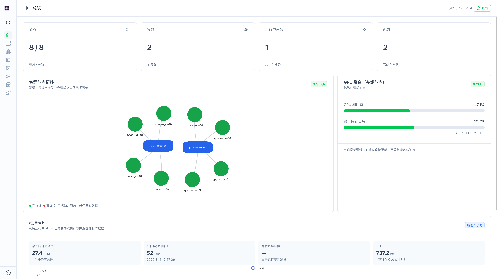
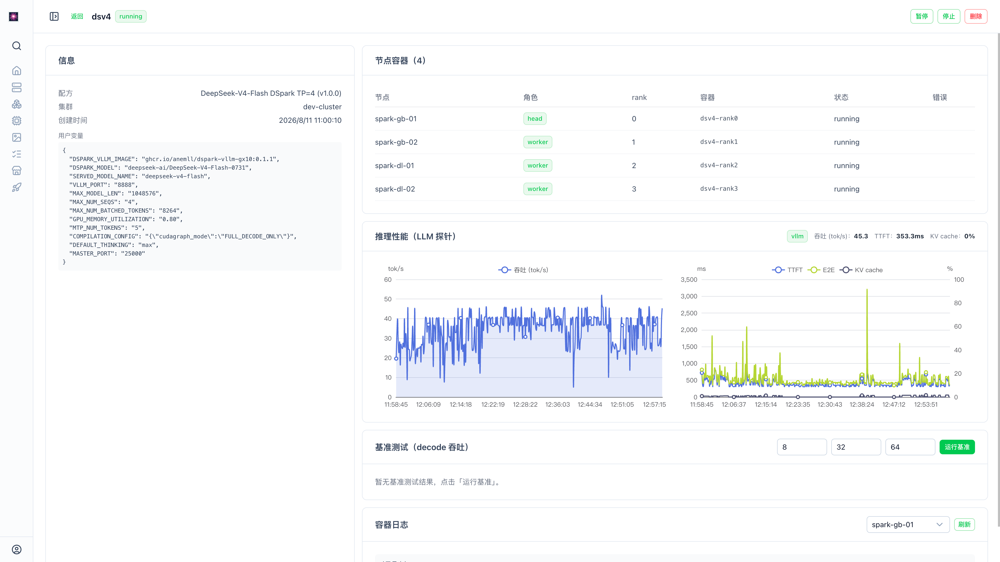

# 🎆 Fireworks — DGX Spark 集群管理工具

[中文](README.md) | [English](README.en.md)

[](https://github.com/skymaze/Fireworks/releases) [](LICENSE) · [变更记录](CHANGELOG.md) · [贡献指南](CONTRIBUTING.md) · [安全策略](SECURITY.md)

面向 NVIDIA DGX Spark（GB10）集群的 Web 管理工具，覆盖**节点、集群、模型、任务、配方**五大能力：

- **节点**：添加节点即 SSH 自动部署 Agent（安装/连通验证失败明确报错并回滚），实时监控（CPU / GPU / 温度 / 统一内存 / 硬盘 / 网络）+ `nvidia-smi`
- **集群**：自动探测四条 RoCE rail 的物理链路、现有网段与 IP 占用，组成集群并事务化配置高速网络，一键网络测试（ping / iperf3 / perftest）
- **模型 / 镜像**：控制平面只下载一份；经管理网发送 head 后，由 worker Agent 通过规划的高速 IP 并行直拉，不依赖节点间 SSH/rsync，并展示逐节点进度、速度与当前文件。模型支持多版本共存、增量更新、发布版本钉扎与历史版本回滚/GC；节点侧镜像可在节点详情直接查看与删除
- **任务**：容器化运行（docker compose），发布时**选座式**按节点指定 head/worker 与 rank（占用节点置灰不可选，空闲节点自动预选）；支持发布 / 暂停 / 继续 / 停止 / **启动** / **重启** / 删除 / 日志 / 健康检查（停止、启动、重启复用容器、不重建）
- **配方**：任务配置模板，变量自动填充（共享 / 节点 / 用户三类源），发布向导一条龙
- **总览**：集群与节点物理拓扑、在线节点 GPU 聚合，以及 vLLM 真实推理流量的 Decode 吞吐（堆叠柱）与输入 token 体量、请求数趋势、TTFT/E2E/TPOT 的 p50 与 p95、KV Cache 与窗口峰值；支持最近 1 小时 / 24 小时窗口。推理统计被动读取 `/metrics`，后端对完整累计快照差分，以完整源区间计算摘要并为图表做时间桶聚合，不发送合成请求

已在 2 台 / 4 台 DGX Spark 真机完成端到端验证。



_总览页面集中展示集群拓扑、在线节点资源与运行中任务的推理性能。_

## 快速开始

### 1. 前置条件

- 安装 **Git**；Windows / macOS 可从 [git-scm.com](https://git-scm.com/downloads) 安装，Linux 使用系统包管理器
- 安装 **Docker**（含 Compose v2）：Windows / macOS 装 [Docker Desktop](https://www.docker.com/products/docker-desktop/)，Linux 装 Docker Engine
- Windows / macOS 启动 Docker Desktop，并等待 Docker Engine 显示为 Running
- 获取部署文件并进入仓库目录：

```bash
git clone https://github.com/skymaze/Fireworks.git
cd Fireworks
docker compose version
```

`docker compose version` 能打印版本号即可；后续命令都在这个 `Fireworks` 目录执行。
- 计划下载大模型时，首次启动前先按「[按操作系统绑定宿主机目录](#按操作系统绑定宿主机目录)」选择容量足够的磁盘；跳过则使用 Docker 默认数据盘

### 2. 选择部署方式

#### HTTP 部署（本机或可信内网）

没有域名和 HTTPS 反向代理时使用。命令会拉取 `latest` 标签镜像并启动服务，随后通过 `http://部署主机IP:3000` 访问。`FW_IMAGE_TAG` 默认即为 `latest`（每次拉最新发布），需要钉扎版本时可显式指定，如 `FW_IMAGE_TAG=0.14.3`。

**中国大陆（阿里云镜像）**

```bash
FW_IMAGE_TAG=latest COOKIE_SECURE=0 docker compose -f docker-compose.prod.cn.yml up -d --pull always
```

**国际 / 海外（GHCR 镜像）**

```bash
FW_IMAGE_TAG=latest COOKIE_SECURE=0 docker compose -f docker-compose.prod.yml up -d --pull always
```

<details>
<summary>Windows PowerShell 命令</summary>

中国大陆：

```powershell
$env:FW_IMAGE_TAG = "latest"
$env:COOKIE_SECURE = "0"
docker compose -f docker-compose.prod.cn.yml up -d --pull always
```

国际 / 海外：

```powershell
$env:FW_IMAGE_TAG = "latest"
$env:COOKIE_SECURE = "0"
docker compose -f docker-compose.prod.yml up -d --pull always
```

</details>

`COOKIE_SECURE=0` 只用于纯 HTTP；请仅在本机或可信内网使用，不要把明文登录入口暴露到公网。

#### HTTPS 部署（域名 + 反向代理）

先按 [`deploy/nginx-fireworks.conf.example`](deploy/nginx-fireworks.conf.example) 配置证书和反向代理，把整个站点（包括 `/api/ws/events` WebSocket）转发到前端 `:3000`，再启动 Fireworks。

**中国大陆（阿里云镜像）**

```bash
FW_IMAGE_TAG=latest docker compose -f docker-compose.prod.cn.yml up -d --pull always
```

**国际 / 海外（GHCR 镜像）**

```bash
FW_IMAGE_TAG=latest docker compose -f docker-compose.prod.yml up -d --pull always
```

<details>
<summary>Windows PowerShell 命令</summary>

如果此前在同一 PowerShell 窗口执行过 HTTP 命令，先删除 `COOKIE_SECURE`，避免沿用不安全配置：

```powershell
Remove-Item Env:COOKIE_SECURE -ErrorAction SilentlyContinue
$env:FW_IMAGE_TAG = "latest"
```

中国大陆：

```powershell
docker compose -f docker-compose.prod.cn.yml up -d --pull always
```

国际 / 海外：

```powershell
docker compose -f docker-compose.prod.yml up -d --pull always
```

</details>

HTTPS 模式不要设置 `COOKIE_SECURE=0`；生产 Compose 默认启用 Secure Cookie。反向代理应将所有 HTTP 请求重定向到 HTTPS。

### 3. 初始化并登录

1. HTTP 部署打开 **http://部署主机IP:3000**；HTTPS 部署打开配置好的域名
2. 首次访问出现「初始化」页 → 创建**管理员账号**
3. 用该账号登录，进入控制台 🎉

启动成功，接下来按「使用流程」接入真实节点。

如果页面打不开，先在仓库目录执行 `docker compose -f docker-compose.prod.cn.yml ps`（中国大陆）或 `docker compose -f docker-compose.prod.yml ps`（国际 / 海外）；`backend` 和 `frontend` 应显示为 `Up` / `healthy`。Linux 与 macOS 可执行 `curl -fsS http://127.0.0.1:8000/api/health`，Windows PowerShell 可执行 `Invoke-RestMethod http://127.0.0.1:8000/api/health`，正常会返回版本与 `ok` 状态。

### 常见问题

| 现象 | 解决 |
|---|---|
| 端口被占用 | 把配置文件里 `"3000:3000"` 的宿主端口改掉，如 `"8080:3000"`，再访问 `localhost:8080` |
| 登录后立刻跳回登录页 / 登录态丢失 | 是纯 HTTP 却没带 `COOKIE_SECURE=0`，重跑上面命令即可 |
| 想在局域网其它电脑访问 | 端口已对局域网开放，直接用部署主机的局域网 IP 访问；后端 `8000` 需保持对所有 Agent 可达 |
| 拉镜像慢 / `pull access denied` | 确认选对了源文件（国内选 cn）；镜像为公开仓库、匿名可拉 |
| `Mounts denied` / 路径无法共享 | Docker Desktop 尚未获准访问所选磁盘；在文件共享设置中允许该目录或磁盘后重试 |
| `no space left on device` | Docker 数据盘或绑定磁盘空间不足；按「Volume 与大模型容量」检查空间并迁移 `fireworks-cache` |

## 使用流程

管理真实集群按此顺序（各页表单内都有提示）：

1. **添加节点（自动部署 Agent）**：`节点 → 添加节点`，填 IP 与 SSH 凭据并保存——控制平面立即经 SSH 上传代码与**离线依赖包**，节点自动安装并以 systemd 托管（开机自启，无需节点访问 PyPI），随后验证连通；**部署与验证通过才算添加成功**，任一失败均明确报错并自动回滚（卸载 Agent + 移除节点，不残留半成品节点）。添加时默认勾选「初始优化」，基于 SSH root/sudo 在节点执行 4 项系统级优化提升集群可用性：关闭 Wi-Fi/蓝牙、关闭图形界面（GUI）、授予当前 SSH 用户 Docker 权限、关闭 swap，然后**重启节点一次性生效**（顺带实测 Agent 是否随系统自启）。优化为 **best-effort**——无法取得 root 或单项失败不会阻断添加，仅随结果提示警告；可在添加弹窗取消勾选，也可对已有节点在列表页点「初始优化」手动补跑（同样会重启节点，结果保存到节点记录，需 root 或 sudo 权限）。节点列表会展示初始优化状态（已优化 / 未完成 / 未优化）
2. **（可选）重新部署 Agent**：未上线（offline / unknown / error）节点可点列表页「重新部署 Agent」修复或重装
3. **创建集群**：`集群 → 创建集群`，弹窗自动填入空闲网段，可手动修改；连续勾选成员节点时不会自动发起耗时网络请求。提交后按用户网段只执行一次权威检查，节点快照读取、ARP 探测、网络应用和验证均按节点并行；网段与现网冲突时返回建议网段，由界面提示并自动更新，不复用节点现网。**全部验证通过才创建、失败自动回滚**，完成后从 Agent 刷新节点信息，避免数据库保留旧网络地址
4. **添加成员**：在集群详情页点击「添加节点」；WebUI 自动分配/避让 IP 槽位，先做同样的物理链路和占用预检，再配置并执行新旧节点双向验证，无需手写脚本或 SSH 操作
5. **配置配方源**：`配方商店 → 添加配方源`，只需填写仓库地址；系统自动读取远端分支并选择默认分支。可在「源设置」中切换分支并自动重同步，或删除源及目录镜像（不影响已安装配方）
6. **发布任务**：`任务 → 发布任务`：选配方 → 选集群 → 指定 head/worker 与各节点 rank（head 固定 rank 0）→ 配置变量 → 预览 → 发布。预览和发布都会先从所选 Agent 刷新节点信息，避免用旧硬件参数渲染
7. **日常管理**：日志 / 暂停 / 继续 / 停止 / 删除、健康检查、模型与镜像分发状态。日志由同一实时流完成历史回放和持续追踪；删除任务会同步清理推理与压测数据，详见[任务生命周期说明](docs/task-lifecycle.md)。模型和镜像均一次点击下载到控制平面，完成后从缓存/归档列表发起分发：先选集群，节点默认全选且首选节点为 head；[模型直传说明](docs/model-transfer.md)和[镜像直传说明](docs/image-transfer.md)记录了状态机与恢复行为



_任务详情页面展示各节点容器与 rank、实时 LLM 推理统计、基准测试和连续日志。_

不同节点原有高速网 IP 可以处于不同网段；只要对应 rail 位于同一二层交换网络，主动 ARP 探测仍能确认物理互联并由 WebUI 统一重配。完整的拓扑要求、地址规划、创建/加节点状态机、回滚边界与错误处理见 [高速网络自动化说明](docs/networking.md)。

> 想改代码？本地开发（后端 / 前端 / 测试）见 [CONTRIBUTING.md](CONTRIBUTING.md)。

## 部署与存储

### 网络与端口

- **HTTP**：浏览器直接访问前端 `:3000`，必须显式设置 `COOKIE_SECURE=0`，仅适合本机或可信内网。
- **HTTPS**：TLS 由 nginx / HAProxy / Caddy 等反向代理终结，Fireworks 保持默认的 `COOKIE_SECURE=1`；配置示例见 [`deploy/nginx-fireworks.conf.example`](deploy/nginx-fireworks.conf.example)。
- **端口**：后端 `:8000` 供节点 Agent 经管理网回拉模型和镜像，必须保持绑定所有宿主机接口，确保不同管理网入口的 Agent 均可访问；前端 `:3000` 供 Web 或反向代理访问。需要限制暴露范围时，应使用宿主机防火墙或网络 ACL 仅允许可信网段访问，不要缩窄 Compose 的端口绑定地址。

### Volume 与大模型容量

| 存储 | 容器路径 | 内容 | 建议介质 |
|---|---|---|---|
| `fireworks-db` | `/data/db` | SQLite 数据库、审计日志 | SSD，定期备份 |
| `fireworks-cache` | `/data/cache` | 控制平面模型缓存、镜像归档、配方源镜像 | 大容量 SSD / HDD，可重新获取 |

两组存储都会在容器重建或普通 `docker compose down` 后保留。不要使用 `docker compose down -v`，除非确定要删除命名卷中的数据库和缓存。

默认使用 Docker 命名卷，卷本身没有单独的容量上限，但可用空间取决于 Docker 数据盘：Linux Docker Engine 通常使用 Docker Root Dir 所在文件系统；Docker Desktop 的卷位于虚拟磁盘内，还会受到 Desktop 磁盘容量设置限制。因此默认配置**不保证**能容纳大尺寸模型。

模型下载会先保存分片，再合并为目标文件。合并期间的峰值占用约为“已完成模型文件 + 当前文件分片 + 当前目标文件”，规划空间时至少预留**模型总大小 + 最大单文件大小**；不确定模型分片结构时，建议按模型总大小的 **2 倍**估算，并额外预留镜像归档和后续模型空间。节点自身保存的模型副本不计入控制平面的 `fireworks-cache`，还需分别检查各节点磁盘。

大模型环境建议在**首次启动前**于仓库根目录创建 `.env`，把缓存直接放到容量明确的宿主机磁盘，无需修改 Compose 文件。以下是 Linux Docker Engine 将两组数据都绑定到本机文件系统的示例；Docker Desktop 建议保留数据库命名卷，只绑定缓存：

```dotenv
FIREWORKS_DB_PATH=/mnt/ssd/fireworks/db
FIREWORKS_CACHE_PATH=/mnt/hdd/fireworks/cache
```

### 按操作系统绑定宿主机目录

以下命令都应在 Fireworks 仓库根目录执行，并会创建或覆盖 `.env`。如果已有 `.env`，请手动加入对应路径配置，不要直接覆盖。数据库应放在支持可靠文件锁与持久化的 Linux 本机文件系统（如 ext4 / XFS），不要放到 NFS / SMB 或 exFAT；大模型缓存可以放在单独的大容量磁盘。macOS / Windows Docker Desktop 下，数据库保留在命名卷中通常具有更好的 SQLite I/O 性能，只绑定大模型缓存。

#### Linux

先用 `lsblk -f` 和 `df -h` 找到已挂载且容量足够的模型磁盘。下面的 `/mnt/large-disk` **必须替换为真实挂载点**；不要仅创建一个同名目录，否则数据仍可能写入系统盘。数据库默认示例使用本机 `/var/lib`。

```bash
FW_DB_PATH="/var/lib/fireworks/db"
FW_CACHE_PATH="/mnt/large-disk/fireworks/cache"
df -h /mnt/large-disk
sudo mkdir -p "$FW_DB_PATH" "$FW_CACHE_PATH"
sudo chown -R "$(id -u):$(id -g)" "$(dirname "$FW_DB_PATH")" "$(dirname "$FW_CACHE_PATH")"
printf 'FIREWORKS_DB_PATH="%s"\nFIREWORKS_CACHE_PATH="%s"\n' \
  "$FW_DB_PATH" "$FW_CACHE_PATH" > .env
docker compose -f docker-compose.prod.yml config
```

使用中国大陆镜像时，最后一行换成 `docker compose -f docker-compose.prod.cn.yml config`。输出中 `/data/db` 和 `/data/cache` 应显示 `type: bind`，并指向刚才选择的路径；确认无误后再执行快速开始中的 HTTP 或 HTTPS 启动命令。

#### macOS

数据库保留在 Docker Desktop 命名卷中，只把模型缓存绑定到外置大容量磁盘。先运行 `ls /Volumes` 查看卷名，并把下例的 `ModelDisk` 换成真实名称：

```bash
FW_CACHE_PATH="/Volumes/ModelDisk/FireworksCache"
df -h /Volumes/ModelDisk
mkdir -p "$FW_CACHE_PATH"
printf 'FIREWORKS_CACHE_PATH="%s"\n' "$FW_CACHE_PATH" > .env
docker compose -f docker-compose.prod.yml config
```

若 Docker 报 `Mounts denied`，在 Docker Desktop 的文件共享设置中允许该外置卷，然后重新执行。输出中 `/data/db` 应为 `type: volume`，`/data/cache` 应为 `type: bind`。中国大陆镜像将检查命令中的文件名换成 `docker-compose.prod.cn.yml`。

#### Windows（PowerShell）

先执行 `Get-PSDrive -PSProvider FileSystem` 查看各盘剩余空间。数据库保留在 Docker Desktop 命名卷中，避免 Windows 路径跨 Linux VM 带来的 SQLite I/O 损耗；请把模型缓存示例中的 `D:` 换成容量足够的真实盘符：

```powershell
$CachePath = "D:\FireworksCache"
New-Item -ItemType Directory -Force -Path $CachePath | Out-Null
$CacheComposePath = $CachePath.Replace('\', '/')
$Utf8NoBom = [System.Text.UTF8Encoding]::new($false)
[System.IO.File]::WriteAllLines(
  (Join-Path $PWD ".env"),
  @("FIREWORKS_CACHE_PATH=`"$CacheComposePath`""),
  $Utf8NoBom
)
docker compose -f docker-compose.prod.yml config
```

输出中 `/data/db` 应显示 `type: volume`，`/data/cache` 应显示 `type: bind` 且源路径指向 `D:/FireworksCache`。如 Docker Desktop 提示无法共享该盘，在设置中允许对应磁盘后重试。中国大陆镜像将检查命令中的文件名换成 `docker-compose.prod.cn.yml`，启动时使用上方对应的 PowerShell 命令。

已有命名卷部署切换到宿主机路径前必须先停止服务并迁移数据，Compose 不会自动复制旧卷内容。新部署完成后可运行 `docker compose -f docker-compose.prod.cn.yml ps` 或 `docker compose -f docker-compose.prod.yml ps` 确认两个服务健康。

可以用 `docker system df` 查看 Docker 当前占用；Linux 还可用 `docker info --format '{{.DockerRootDir}}'` 找到数据根目录，再用 `df -h` 检查其所在磁盘。数据库卷应纳入备份，模型和镜像缓存则可在确认不再使用后重新下载。

升级到当前版本（0.14.x）：可直接复用已有 `fireworks-db`，无新增数据迁移；控制面与前端升级后，节点 Agent 自 v0.14.0 起无行为变更、通常无需重部署（控制面若提示版本不一致，再对节点点「重新部署 Agent」即可）。完整升级说明见 [v0.14.3 发布说明](docs/releases/v0.14.3.md)，历史版本见 [docs/releases/](docs/releases/)。

## 架构

```
┌────────────── 控制平面（Docker Compose）──────────────┐
│  Nuxt 4 前端 (3000) ──/api 代理──►  FastAPI 后端 (8000) │
│                                     SQLite 指标库       │
└──────────────────────┬─────────────────────────────────┘
                 SSH 自动部署 │  REST (9000)
       ┌───────────────┼──────────────────┐
       ▼               ▼                  ▼
   Agent #节点       Agent #节点        Agent #节点
   （指标采集 / docker compose / 网络测试；head/worker 由每次任务指定）
```

链路：Nuxt 前端 → FastAPI 控制平面 → 每节点一个轻量 Agent（添加节点时 SSH 自动部署，采集指标、运行容器任务、执行网络互测）。

## 目录结构

```
├── docker-compose.yml          # 开发：本地构建控制平面（后端 + 前端）
├── docker-compose.prod.yml     # 生产·国际版（GHCR 预构建镜像）
├── docker-compose.prod.cn.yml  # 生产·中国大陆版（阿里云预构建镜像）
├── .github/workflows/          # CI：validate（typecheck+单测）与 release（发布时推送镜像）
├── deploy/nginx-fireworks.conf.example  # 反向代理示例（TLS + WebSocket）
├── docs/networking.md         # 高速网络探测、配置、验证与排障
├── docs/task-lifecycle.md     # 任务发布节点刷新、连续日志与数据清理
├── docs/model-transfer.md     # 模型 manifest、Agent 高速直传、进度与恢复
├── docs/image-transfer.md     # 镜像拉取、Agent 高速直传、进度与失败恢复
├── docs/releases/             # 各版本安装、升级与组件版本说明
├── docs/releasing.md          # 维护者发布、验证与回滚清单
├── agent/                      # 节点 Agent：单文件 FastAPI 服务 + 部署脚本（离线装依赖）
├── backend/app/                # FastAPI 控制平面（routers / services / 配方源初始化）
└── frontend/app/               # Nuxt 4 + Nuxt UI v4 前端（pages / server API 代理）
```

## 环境变量

后端控制平面（Compose 中可覆盖）：

| 变量 | 默认 | 说明 |
|---|---|---|
| `DATABASE_URL` | `sqlite:////data/db/fireworks.db` | 数据库路径 |
| `COOKIE_SECURE` | 后端默认关闭；生产 Compose 默认 `1` | HTTP 部署显式设 `0`；HTTPS 保持生产默认值 |
| `SESSION_TTL_HOURS` | `168` | 登录会话有效期（小时），到期需重新登录 |
| `CORS_ORIGINS` | `http://localhost:3000` | 允许跨域来源（逗号分隔），同源部署基本不参与 |
| `METRIC_POLL_INTERVAL` | `5` | 指标轮询间隔（秒） |
| `METRIC_RETENTION_HOURS` | `24` | 指标保留时长（小时） |
| `INFERENCE_RETENTION_HOURS` | `25` | 推理快照保留时长；默认比 24 小时窗口多留一小时作为差分基线 |
| `AGENT_PORT` / `AGENT_DEPLOY_DIR` | `9000` / `/opt/fireworks-agent` | Agent 监听端口 / 安装目录 |
| `API_PROXY_TARGET` | `http://backend:8000` | 前端 /api 代理目标 |

> Agent 回拉模型 / 镜像的地址无需配置：自动从「下发请求来源 IP」推断控制端地址。
